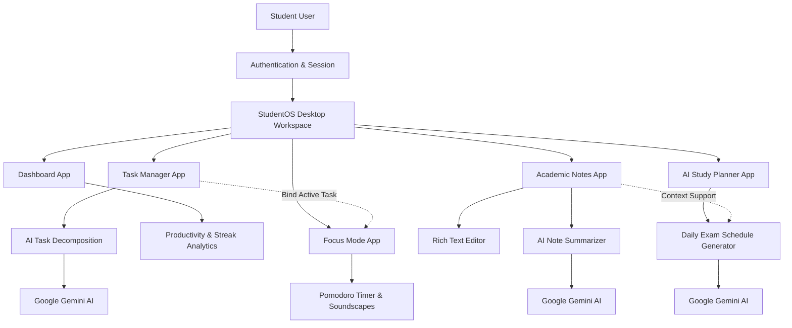

# StudentOS

> An all-in-one personal operating system for students to manage academics, tasks, focus sessions, and AI-assisted study planning.

StudentOS is a web-based desktop environment built to centralize student productivity into a single workspace. Instead of juggling multiple disconnected apps for notes, task management, focus timers, and study schedules, StudentOS brings everything into a clean, distraction-free, window-based operating system interface.

---

## Overview

StudentOS transforms your browser into an intuitive desktop experience tailored for academic success. Students can run multiple applications simultaneously in draggable, resizable windows, enabling smooth multitasking between note-taking, task tracking, and study planning.

---

## System Workflow

---

## Core Applications

### Desktop Environment
- **Window Management**: Open, drag, minimize, maximize, and arrange application windows across your desktop workspace.
- **Taskbar & Dock**: Quickly launch applications, toggle active windows, and view real-time system status.
- **Modern Interface**: Designed with a clean dark-mode glassmorphism aesthetic for distraction-free studying.

### Dashboard
- **Productivity Tracking**: View your daily completion rate, active study streak (days), completed tasks, and total focus time.
- **Visual Analytics**: Monitor your weekly task completion progress through interactive charts.
- **Upcoming Overview**: Keep track of today's urgent tasks and approaching exam deadlines at a glance.

### Task Manager
- **Prioritization & Deadlines**: Organize academic tasks by priority levels (Low, Medium, High) and due dates.
- **AI Task Breakdown**: Convert complex assignments or projects into actionable sub-tasks with one click.
- **Progress Tracking**: Filter tasks by status and mark items complete inline.

### Academic Notes
- **Rich Text Editor**: Take detailed lecture notes with full formatting tools, headings, lists, and quotes.
- **Subject Organization**: Group notes by custom academic subjects for quick reference.
- **AI Summarizer**: Instantly condense lengthy study notes into concise, key-point bullet summaries for exam revision.

### AI Study Planner
- **Automated Exam Prep**: Generate a structured, day-by-day study roadmap based on your subject, target exam date, and optional syllabus document.
- **Context-Aware Scheduling**: Integrates existing subject notes into study plan generation to focus on topics you haven't reviewed yet.

### Focus Mode (Pomodoro Timer)
- **Customizable Intervals**: Set custom focus durations, short breaks, and long breaks.
- **Task Binding**: Link active tasks directly to your focus session to log study time against specific goals.
- **Ambient Soundscapes**: Built-in background audio options to enhance concentration.

### Settings & System Logs
- **Customization**: Manage user profile details, theme settings, and preferences.
- **Activity Logs**: Track system activity and study history.

---

## Key Benefits

- **Centralized Workspace**: Eliminates context switching across separate tabs and tools.
- **AI Assistance**: Automates study scheduling, note summarization, and task breakdown.
- **Flow & Focus**: Combines task tracking directly with a Pomodoro timer and ambient audio.
